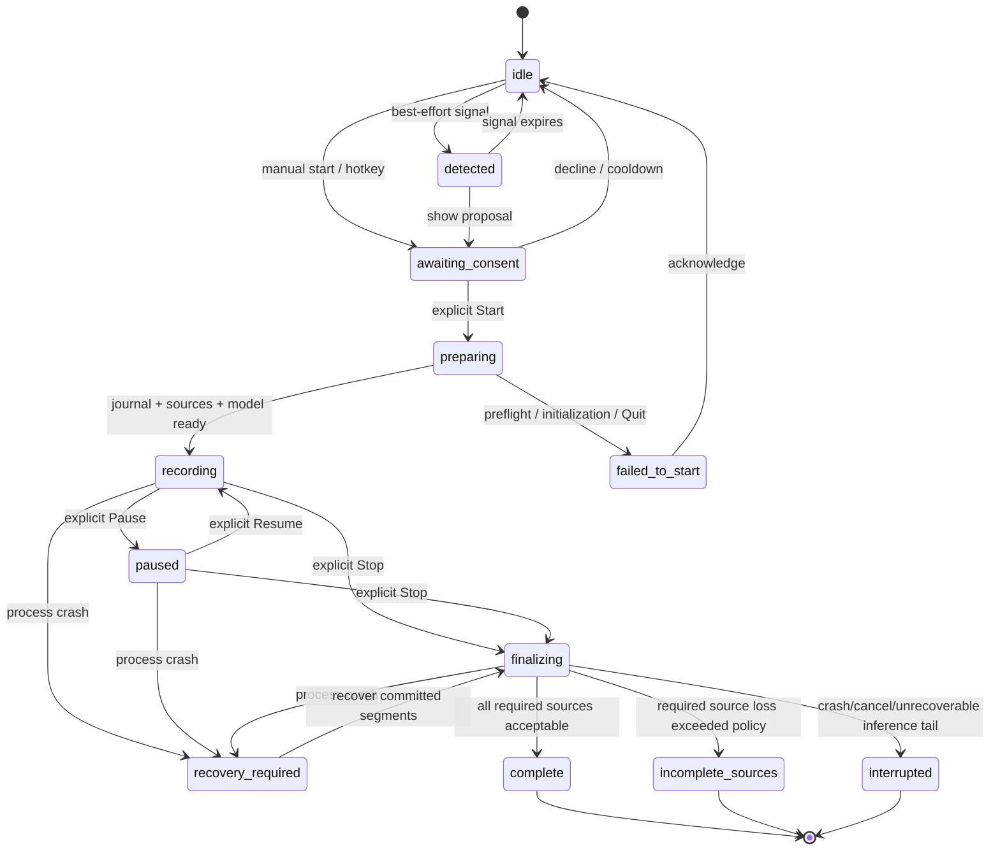

# Session state machine

## Canonical model

The state machine has three related values:

1. `shell_state` — ephemeral proposal/UI state before consent;
2. `phase` — canonical core phase persisted in SQLite after consent;
3. `published_status` — Product Reference status rendered to Markdown.

This distinction is required because the PRD forbids creating/recording a file
before consent but defines pre-consent states in the overall workflow.

## State diagram



## State table

| State | Persisted | Capture open | Markdown exists | Published status |
|---|---:|---:|---:|---|
| `idle` | no | no | no | — |
| `detected` | no | no | no | — |
| `awaiting_consent` | no | no | no | — |
| `preparing` | yes | not until preflight succeeds | staging may be prepared, not published | — |
| `recording` | yes | yes | yes | `recording` |
| `paused` | yes | stopped/suspended | yes | `recording` |
| `finalizing` | yes | no | yes | `recording` |
| `recovery_required` | yes | no | recovery/staging snapshot | `interrupted` when published |
| `failed_to_start` | diagnostic row only | no | no | — |
| `complete` | yes | no | yes | `complete` |
| `incomplete_sources` | yes | no | yes | `incomplete_sources` |
| `interrupted` | yes | no | yes | `interrupted` |

## Consent invariant

`CapturePort.start()` is legal only during the transition
`awaiting_consent → preparing`, and only with a non-reusable `ConsentToken`
created by the visible Start action.

- Detection cannot create a token.
- Restoring app state cannot create a token.
- Recovery cannot automatically reopen capture.
- Resume after a user pause is a visible user action.
- A test harness can use an explicit test consent token only in a process
  compiled/configured as a test product.

Violation is a fatal state-transition error before any capture adapter call.

## Detected-call proposals

Best-effort Zoom/Telemost/Google Meet/Skype detection owns an ephemeral episode
UUID. The session actor accepts that UUID only from `idle` or the same safe
terminal shell states as manual start, emits `detected`, and moves to
`awaiting_consent` for the visible panel. A detected Start, dismissal, or
call-end event must present the same UUID; stale episode events are ignored.
Manual consent has no detected episode UUID and cannot be dismissed by a
detector event.

The detector is started only after startup recovery has completed successfully.
If a call ends while its proposal is still pending, the proposal returns to
`idle`. Once visible Start has been accepted, later detector events have no
authority over `preparing`, `recording`, or finalization and never stop capture.

## Transition transaction rules

For every persisted transition:

1. validate expected current phase and legal transition;
2. begin an SQLite immediate transaction;
3. append an immutable state event with monotonic sequence;
4. update the session row and source completeness flags;
5. commit;
6. emit the value event to Swift;
7. schedule a Markdown snapshot if a published value changed.

UI state may lag the commit, but may not announce a later state before commit.

For a final segment:

1. validate stable ID, time range, source, final flag, and revision;
2. insert or supersede the segment in an SQLite transaction;
3. update the journal’s highest committed segment revision;
4. commit;
5. enqueue a final-segment event;
6. coalesce a Markdown snapshot request;
7. record a publication receipt after atomic publication.

Killing the process between steps 4 and 7 can delay Markdown publication but
cannot lose the committed segment; recovery re-renders it.

## Source completeness

Source health is orthogonal to the phase:

```text
unknown → ready → active ↔ temporarily_unavailable
                      ↘ permanently_lost
```

Each gap stores source ID, monotonic start/end, reason, and whether it was
injected by a test. A gap is displayed immediately and rendered as a neutral
capture event, never fabricated dialogue.

For the vertical:

- any required source never becoming active prevents `recording`;
- discontinuity/frame-accounting events never mutate durable source health;
  only actual ready/active/unavailable/recovered/lost transitions do;
- a recovered gap is retained in the journal;
- a required source permanently lost, or unavailable for more than the
  configured completeness threshold, makes the terminal state
  `incomplete_sources`;
- a short recovered gap can still end `complete`, but remains explicitly
  marked and measurable;
- the terminal decision and threshold are stored so recovery is deterministic.

## Pause semantics

- Pause stops accepting new audio and flushes already accepted inference work.
- Final segments produced from pre-pause audio are journaled normally.
- Pause start/end are journal events and create a timeline discontinuity.
- Time labels remain relative to original session start; paused wall time is
  not compressed.
- Resume starts new source sequence epochs and marks discontinuity.
- Start/Resume callbacks remain behind a parked frame barrier until both
  required adapters are ready; Resume journals the elapsed startup gap for
  both sources before the router becomes active.
- Capture adapters invalidate each previous binding before a new epoch; delayed
  callbacks from an old ScreenCaptureKit stream cannot change new-source
  health.
- Markdown contains no unstable partial text from either side of the boundary.

## Finalization

Finalization is idempotent:

1. reject new frames;
2. drain accepted queues;
3. flush ASR and diarization;
4. commit tail final segments;
5. compute source completeness;
6. transition to a terminal phase;
7. copy the authoritative terminal state directly from core without consuming
   or timing the event queue;
8. render from a single committed snapshot;
9. publish atomically or to staging;
10. acknowledge the digest/revision.

Repeated finalization after a crash must produce byte-identical Markdown for the
same journal snapshot.

Swift bounds its wait for the terminal file sink. If that boundary expires,
capture is already closed and the terminal SQLite transition remains canonical;
the missing exact receipt makes the session publication-recoverable on the next
launch. Quit also has a bounded adapter-stop escape after detaching frame
routing, so a framework-level `stopCapture` stall cannot keep AppKit waiting
indefinitely. Model preparation, pause/drain, and finalization do not execute on
the session actor, so delayed native work cannot prevent Quit from entering the
privacy shutdown path.

Direct Quit is deliberately not a second unbounded `Stop`. It attempts both
adapter stops concurrently, removes the session handle from actor-owned state,
and gives detached native finalization a fixed deadline. No terminal vault
publication is awaited from the AppKit termination path. If process exit wins
that race, the journal row or missing exact receipt is selected by startup
recovery; capture is never restarted.

## Crash recovery

At startup:

1. migrate the journal schema transactionally;
2. mark nonterminal sessions `recovery_required` once for this recovery
   attempt, including a session left `finalizing` by an earlier failed attempt;
3. also select terminal sessions whose receipt does not match their exact
   checkpoint and highest revision;
4. finalize `recovery_required` as `interrupted`, while preserving an already
   committed `complete`, `incomplete_sources`, or `interrupted` phase;
5. render all committed final revisions with the exact render-snapshot token;
6. publish to the owned file, staging, or a recovery copy according to file
   access and conflict state;
7. acknowledge that exact token only after atomic publication.

The vertical guarantees committed final segments. It does not claim that
unfinalized model buffers survive a process kill unless a later ADR introduces
an encrypted raw-audio spool. Stage 0 never resumes capture from recovery.
Every recoverable ID is attempted. A failed row remains the presented
`recovery_required` result even if later rows succeed; new capture stays
disabled until **Retry Recovery** re-scans the durable queue and all rows are
acknowledged.

## Invalid transitions

Examples rejected without side effects:

- `detected → recording`;
- `awaiting_consent → recording` without preflight/journal creation;
- any terminal state → `recording`;
- `paused → recording` from a detection signal;
- `recording → complete` without finalization;
- finalization while a capture callback can still enqueue frames;
- writing `complete` when a required source is classified incomplete;
- creating a transcript or opening capture during application restoration.
