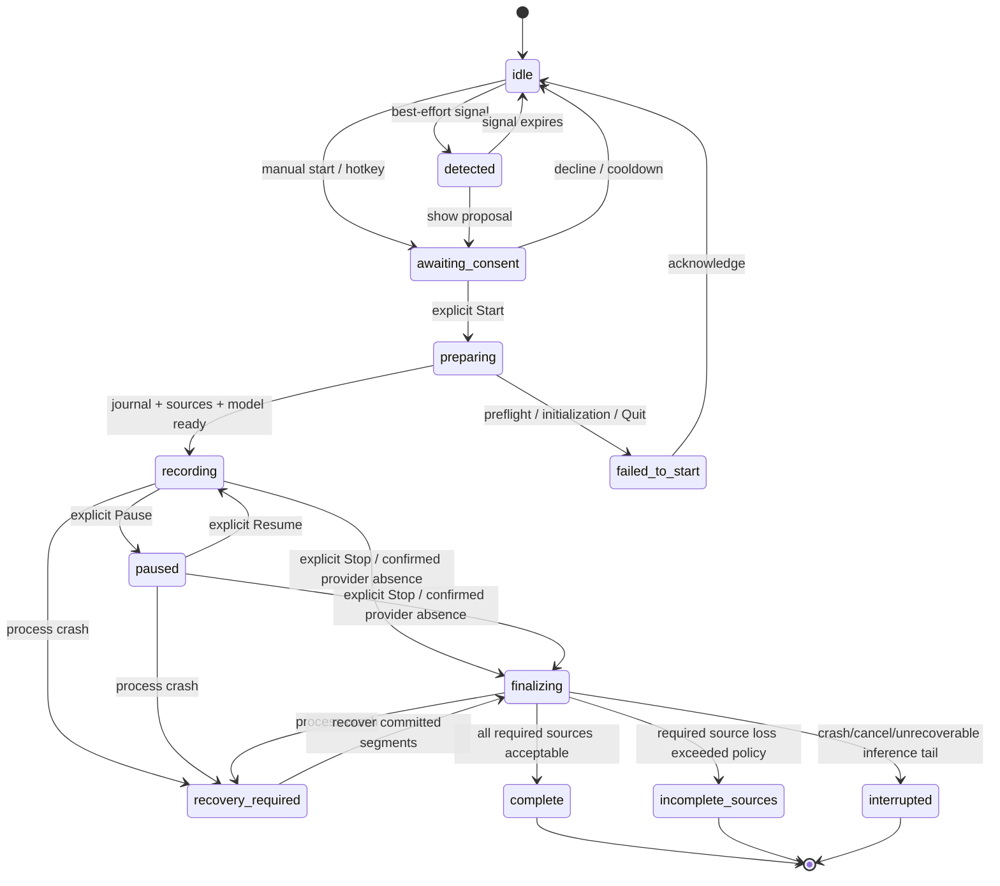

# Session state machine

## Canonical model

The state machine has three related values:

1. `shell_state` — ephemeral proposal/UI state before consent;
2. `phase` — canonical core phase persisted in SQLite after consent;
3. `published_status` — Product Reference status rendered to Markdown.

This distinction is required because the PRD forbids creating/recording a file
before consent but defines pre-consent states in the overall workflow.

## State diagram



## State table

| State | Persisted | Capture open | Markdown exists | Published status |
|---|---:|---:|---:|---|
| `idle` | no | no | no | — |
| `detected` | no | no | no | — |
| `awaiting_consent` | no | no | no | — |
| `preparing` | yes | not until preflight succeeds | staging may be prepared, not published | — |
| `recording` | yes | yes | yes | `recording` |
| `paused` | yes | stopped/suspended | yes | `recording` |
| `finalizing` | yes | no | yes | `recording` |
| `recovery_required` | yes | no | recovery/staging snapshot | `interrupted` when published |
| `failed_to_start` | diagnostic row only | no | no | — |
| `complete` | yes | no | yes | `complete` |
| `incomplete_sources` | yes | no | yes | `incomplete_sources` |
| `interrupted` | yes | no | yes | `interrupted` |

## Consent invariant

`CapturePort.start()` is legal only during the transition
`awaiting_consent → preparing`, and only with a non-reusable `ConsentToken`
created by the visible Start action.

- Detection cannot create a token.
- Restoring app state cannot create a token.
- Recovery cannot automatically reopen capture.
- Resume after a user pause is a visible user action.
- A test harness can use an explicit test consent token only in a process
  compiled/configured as a test product.

Violation is a fatal state-transition error before any capture adapter call.

## Detected-call proposals

Best-effort Zoom/Telemost/Google Meet/Skype detection owns an ephemeral episode
UUID. The session actor accepts that UUID only from `idle` or the same safe
terminal shell states as manual start, emits `detected`, and moves to
`awaiting_consent` for the visible panel. A detected Start, dismissal, or
call-end event must present the same UUID; stale episode events are ignored.
Manual consent has no detected episode UUID and cannot be dismissed by a
detector event.

The detector is started only after startup recovery has completed successfully.
If a call ends while its proposal is still pending, the proposal returns to
`idle`. Once visible Start has been accepted, its UUID becomes the active
session authority. Presence remains a provider/platform-level observation:
another surface from the same platform counts as recovery, while evidence from
other platforms is ignored. Only the reducer associated with the active UUID
may request auto-stop; stale proposals and manual-start sessions are ignored.

Auto-stop has a separate conservative reducer: ten consecutive known negative
one-second samples show a ten-second warning. During `recording` capture
continues and during `paused` it stays paused. If the deadline matures during
`preparing`, the request waits behind the lifecycle lock and can finalize only
after startup reaches `recording`; a failed start discards it. Unknown samples
freeze confirmation and an overdue countdown rather than stopping.
**Keep Recording**, closing the warning, or Escape snoozes it for five minutes;
known recovery re-arms immediately, and continued absence after snooze shows a
fresh countdown. A completed countdown or **Stop Now** follows the serialized
Stop path but persists `call_ended` instead of `user_stop`. The association is
ephemeral and clears on failed start, terminal completion, interruption,
recovery, and Quit.

## Transition transaction rules

For every persisted transition:

1. validate expected current phase and legal transition;
2. begin an SQLite immediate transaction;
3. append an immutable state event with monotonic sequence;
4. update the session row and source completeness flags;
5. commit;
6. emit the value event to Swift;
7. schedule a Markdown snapshot if a published value changed.

UI state may lag the commit, but may not announce a later state before commit.

For each ordered `AsrTimelineBatch`:

1. validate its source, decoded interval, discontinuity marker, hypothesis stable
   IDs, time ranges, final flags, and revisions;
2. pass the batch to diarization, which classifies every hypothesis before it
   applies `finalizedThroughTimeNs` as the per-source decoded watermark;
3. apply the returned `DiarizationUpdate`: a Final Segment marked `commit` is
   inserted or superseded visibly, while one marked `hold` is stored with its
   complete payload and saved fallback attribution in a hidden pending group;
4. apply each whole-group `resolve` atomically, promoting every staged revision
   with either its confirmed speaker or its persisted fallback speaker;
5. advance the highest visible revision, timeline origin, committed-segment
   metrics, and participant/enrollment state only for direct commits and
   promoted groups;
6. commit before enqueuing any corresponding Final Segment event;
7. coalesce a Markdown snapshot request only when visible transcript state
   changed, then record a publication receipt after atomic publication.

Staging a pending group advances the journal checkpoint once, but does not
advance the highest visible revision or timeline origin and does not emit an
event. Killing the process after private staging cannot lose the Final ASR text;
recovery promotes it with its fallback attribution before rendering.

## Pending speaker-switch invariant

The confirmation thresholds and fallback conditions are fixed by
[ADR-0005](ADR-0005-inertial-speaker-switches.md). At most 64 revisions belong
to one pending group. Until `resolve`, its text,
descriptor, tentative target, and fallback attribution are absent from public
segment events, committed-segment metrics, participant queries, Voice Profile
enrollment, and Markdown. Confirmation or fallback makes the complete group
visible at one new journal checkpoint, so the first visible segment already has
its final published speaker and clients never need a correction event.

The five-second hard deadline advances only with
`AsrTimelineBatch.finalizedThroughTimeNs` for fully processed System Audio. Empty
batches for decoded silence advance it; raw audio timestamps, buffered audio,
microphone progress, and wall time do not. Hypotheses are evaluated before the
same batch's watermark, allowing compatible evidence that ends exactly at the
deadline to confirm. A discontinuity resolves the group to fallback before the
new timeline epoch is considered.

## Source completeness

Source health is orthogonal to the phase:

```text
unknown → ready → active ↔ temporarily_unavailable
                      ↘ permanently_lost
```

Each gap stores source ID, monotonic start/end, reason, and whether it was
injected by a test. A gap is displayed immediately and rendered as a neutral
capture event, never fabricated dialogue.

For the vertical:

- any required source never becoming active prevents `recording`;
- discontinuity/frame-accounting events never mutate durable source health;
  only actual ready/active/unavailable/recovered/lost transitions do;
- a recovered gap is retained in the journal;
- a required source permanently lost, or unavailable for more than the
  configured completeness threshold, makes the terminal state
  `incomplete_sources`;
- a short recovered gap can still end `complete`, but remains explicitly
  marked and measurable;
- the terminal decision and threshold are stored so recovery is deterministic.

## Pause semantics

- Pause stops accepting new audio and drains already accepted inference work.
- The session flushes the ASR-owned model/chunk tail, applies every returned
  timeline batch, then calls `flush(DiarizationFlushReason::pause)`.
- The diarization flush fallback-resolves and atomically promotes every remaining
  pending group before the `paused` transition is committed.
- Pause start/end are journal events and create a timeline discontinuity.
- Time labels remain relative to original session start; paused wall time is
  not compressed and does not advance a decoded-audio deadline.
- Resume starts new source sequence epochs and marks discontinuity.
- Start/Resume callbacks remain behind a parked frame barrier until both
  required adapters are ready; Resume journals the elapsed startup gap for
  both sources before the router becomes active.
- Capture adapters invalidate each previous binding before a new epoch; delayed
  callbacks from an old ScreenCaptureKit stream cannot change new-source
  health.
- Markdown contains no unstable partial text from either side of the boundary.

## Finalization

Finalization is idempotent:

1. reject new frames;
2. drain accepted queues;
3. flush ASR and process every returned tail `AsrTimelineBatch` through
   diarization;
4. call `flush(DiarizationFlushReason::endOfStream)` and fallback-promote every
   unresolved pending group;
5. commit all visible tail Final Segments and verify that no pending group
   remains;
6. compute source completeness;
7. transition to a terminal phase;
8. copy the authoritative terminal state directly from core without consuming
   or timing the event queue;
9. render from a single committed visible snapshot;
10. publish atomically or to staging;
11. acknowledge the digest/revision.

The journal performs a final backend-independent fallback sweep before the
terminal transition. This preserves staged text even if diarization fails or an
in-flight assignment is abandoned at the bounded finalization deadline. A late
backend result is discarded and cannot create a segment after the terminal
event.

Repeated finalization after a crash must produce byte-identical Markdown for the
same journal snapshot.

Swift bounds its wait for the terminal file sink. If that boundary expires,
capture is already closed and the terminal SQLite transition remains canonical;
the missing exact receipt makes the session publication-recoverable on the next
launch. Quit also has a bounded adapter-stop escape after detaching frame
routing, so a framework-level `stopCapture` stall cannot keep AppKit waiting
indefinitely. Model preparation, pause/drain, and finalization do not execute on
the session actor, so delayed native work cannot prevent Quit from entering the
privacy shutdown path.

Direct Quit is deliberately not a second unbounded `Stop`. It attempts both
adapter stops concurrently, removes the session handle from actor-owned state,
and gives detached native finalization a fixed deadline. No terminal vault
publication is awaited from the AppKit termination path. If process exit wins
that race, the journal row or missing exact receipt is selected by startup
recovery; capture is never restarted.

## Crash recovery

At startup:

1. migrate the journal schema transactionally;
2. fallback-promote every unresolved durable pending group without attempting to
   reconstruct the non-persisted speculative target;
3. only then mark nonterminal sessions `recovery_required` once for this
   recovery attempt, including a session left `finalizing` by an earlier failed
   attempt;
4. also select terminal sessions whose receipt does not match their exact
   checkpoint and highest revision;
5. finalize `recovery_required` as `interrupted`, while preserving an already
   committed `complete`, `incomplete_sources`, or `interrupted` phase;
6. render all visible committed Final Segment revisions with the exact
   render-snapshot token;
7. publish to the owned file, staging, or a recovery copy according to file
   access and conflict state;
8. acknowledge that exact token only after atomic publication.

The vertical guarantees visible committed Final Segments and durably staged
Final ASR text. Recovery conservatively attributes the latter to its saved
fallback speaker; it does not reconstruct speculative acoustic evidence. It
does not claim that unfinalized model buffers survive a process kill unless a
later ADR introduces an encrypted raw-audio spool. Stage 0 never resumes capture
from recovery.
Every recoverable ID is attempted. A failed row remains the presented
`recovery_required` result even if later rows succeed; new capture stays
disabled until **Retry Recovery** re-scans the durable queue and all rows are
acknowledged.

## Invalid transitions

Examples rejected without side effects:

- `detected → recording`;
- `awaiting_consent → recording` without preflight/journal creation;
- any terminal state → `recording`;
- `paused → recording` from a detection signal;
- auto-stopping a manual session or a detected session with a stale/wrong
  episode UUID;
- `recording → complete` without finalization;
- finalization while a capture callback can still enqueue frames;
- writing `complete` when a required source is classified incomplete;
- creating a transcript or opening capture during application restoration.
